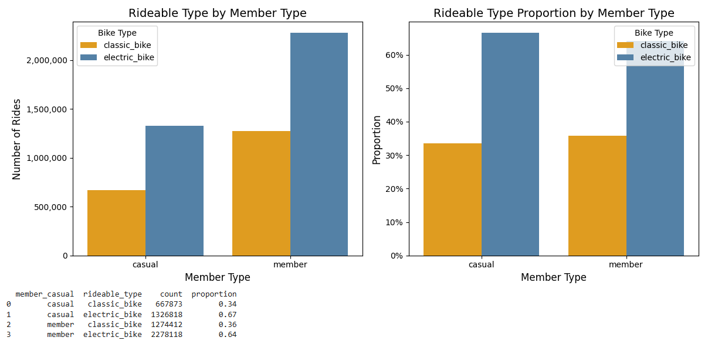
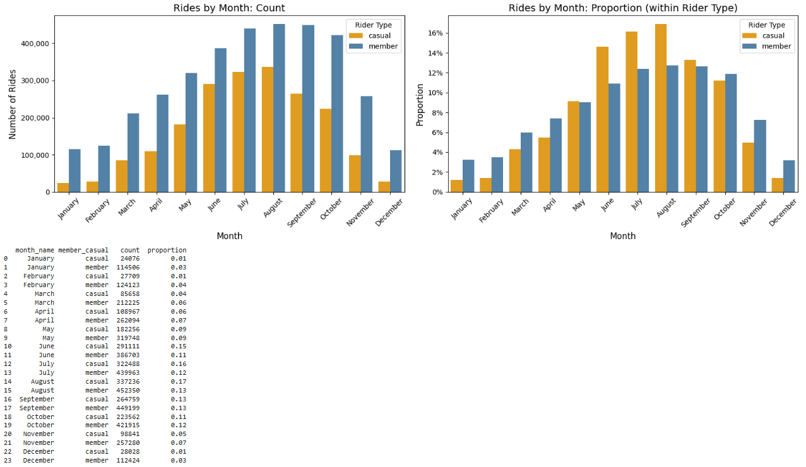
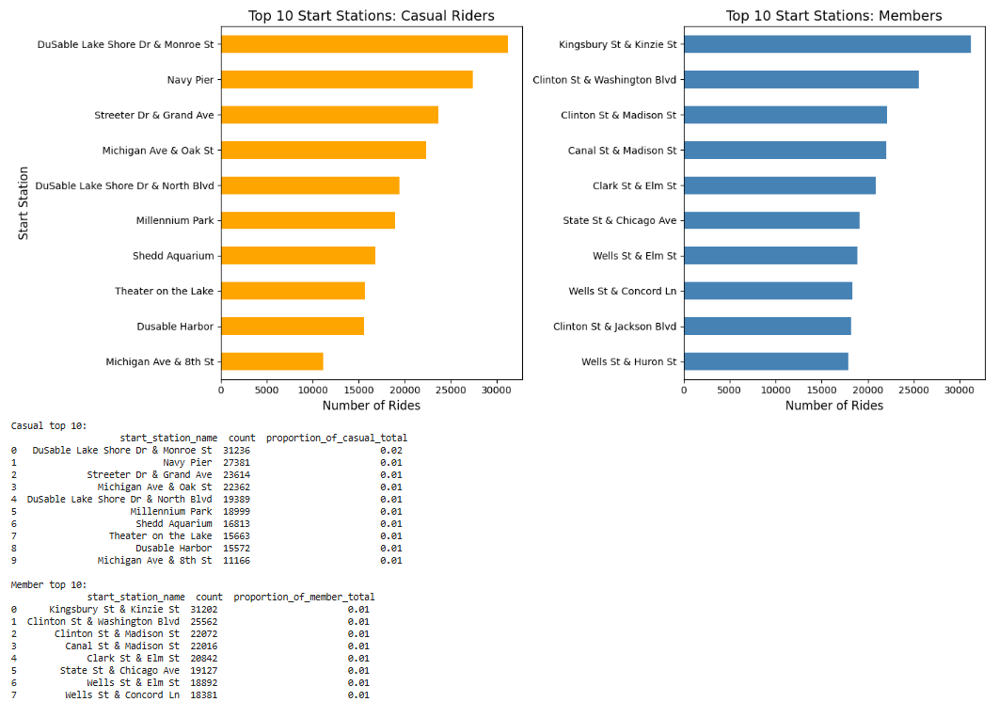
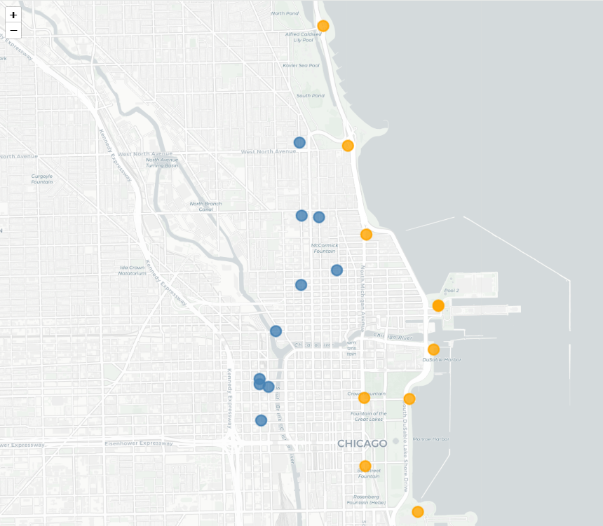

# Cyclistic-Bike-Share-Analysis-Capstone-Project

Google Data Analytics Capstone project for the Google Data Analytics Certificate (Google/Coursera, July 2026) analyzing member vs. casual rider behavior

## Executive Summary

- Analyzed 5.5M Divvy/Cyclistic bike-share trips (2025 data, City of Chicago) to compare member vs. casual rider behavior
- Conducted EDA using Python, pandas, R/ggplot2 and Folium across six areas: Dataset Overview, Missing Station Investigation, Ride Patterns, Temporal Analysis, Statistical Visualizations and Geospatial Analysis
- Found a consistent behavioral divide across every dimension examined: members ride for commuting (weekday, bimodal, business-district), casual riders ride for leisure (weekend, summer, lakefront)
- Top 3 recommendations: electric bike-focused membership incentives, seasonal & shoulder-month conversion campaigns and landmark & attraction-based membership benefits
- Limitations & further research: missing demographic data (age, sex), station-type classifications ("touristic" vs. "business-district") need to be further validated, start→end station pairs were not analyzed per-ride, single-year focus (2025) limits multi-year comparison, recommendations should be A/B tested before rollout
- Business impact: the analysis shows evidence-based targeting (e.g., geospatial analysis reveals station-level conversion opportunities), replaces guesswork and helps prevent failures — poor data and weak strategy contribute to 14% of overall business failures tied directly to marketing ([Cropink](https://cropink.com/failed-marketing-campaigns), 2026)

## Project Overview

The project analyzed member vs. casual rider behavior based on 5.5M Divvy/Cyclistic bike-share trips (2025) using Python, pandas, R/ggplot2 and Folium. The analysis followed these steps:

**Key steps:**
* Imports & Setup
* Load & Merge Data
* Data Cleaning
* Exploratory data analysis (EDA)
* Summary of EDA Findings
* Top Three Recommendations
* Conclusion

## Business Problem

Cyclistic is a fictive bike-share company in Chicago. Their director of marketing wants to maximize the number of annual memberships. For that reason, the data analytics team is asked to analyze the different usage behaviors of casual riders and annual members. Based on the results, the data analytics team should provide recommendations for a new marketing strategy. The analysis followed three guiding questions, with a primary analytical focus on the first one:

1. How do annual members and casual riders use Cyclistic bikes differently?
2. Why would casual riders buy Cyclistic annual memberships?
3. How can Cyclistic use digital media to influence casual riders to become members?

## Dataset

- **Source:** Divvy Trips dataset, published by the City of Chicago on the Chicago Data Portal
- **Link:** [Divvy Trips — Chicago Data Portal](https://data.cityofchicago.org/Transportation/Divvy-Trips/fg6s-gzvg/about_data)
- **Raw data URL:** [Divvy trip data S3 bucket](https://divvy-tripdata.s3.amazonaws.com/index.html) (12 monthly ZIP files, Jan-Dec 2025)
- **Size:** ~5.55M rides across 12 months (Jan-Dec 2025)
- **Documentation:** [divvybikes.com/system-data](https://divvybikes.com/system-data)

**Fields used:** `ride_id`, `rideable_type`, `started_at`, `ended_at`, `start_station_name`/`id`, `end_station_name`/`id`, `start_lat`/`lng`, `end_lat`/`lng`, `member_casual`

**Note on demographic data:** the Divvy Trips documentation states that subscriber-pass trips may include basic demographic fields (age, gender). However, the 2025 extract used in this analysis does not include any demographic columns — only trip, station and rider-type (member/casual) data are present.

**Note on data context (2025 vs. earlier Divvy/Cyclistic analyses):** readers comparing this analysis to other Cyclistic capstone projects (many of which use 2019-2021 data, the original case study period) should note that the Divvy station network grew substantially in 2025 — Chicago's Department of Transportation and the ride-sharing company Lyft opened 140 new stations that year, adding more than 2,000 new docks ([WTTW](https://news.wttw.com/2026/01/15/divvy-and-lime-saw-highest-ridership-record-2025-nearly-13m-bike-and-scooter-trips), 2026). Due to this expansion, station-level findings (e.g., top 10 start/end stations) may not directly match earlier analyses. Other data fields, such as `rideable_type` (classic/electric bike) and `member`/`casual` rider-type, are not affected — this schema has been consistently used across public Divvy trip data since at least 2020, based on cross-checking multiple years of published datasets.

*Data license: this repository's code is MIT-licensed (see LICENSE), but the underlying Divvy trip data remains subject to the [Divvy Data License Agreement](https://divvybikes.com/data-license-agreement), which governs how the data may be accessed, analyzed and redistributed.*

## Setup / Reproducing this Analysis

This repository does not include the raw trip data (12 monthly CSVs, ~5.55M rows total) due to file size. To reproduce this analysis:

1. Download the 12 monthly ZIP files for 2025 from the [Divvy trip data S3 bucket](https://divvy-tripdata.s3.amazonaws.com/index.html)
2. Extract each ZIP to get the monthly CSV files
3. Upload the extracted CSVs to a folder in your Google Drive (this notebook was built and run in Google Colab)
4. Update the `data_path` variable in the "Load & Merge Data" section to point to your own Google Drive folder:
```python
   data_path = '/content/drive/MyDrive/<your-folder-path>/'
```
5. Run the notebook from the top — the first code cell mounts your Google Drive (`drive.mount('/content/drive')`) and the merge step will automatically load and concatenate all 12 CSVs found in that folder

**Note:** the notebook expects exactly 12 monthly CSV files in the specified folder; the `glob.glob(data_path + '*.csv')` pattern will pick up any CSV present, so avoid placing unrelated CSV files in the same folder.

## Approach

EDA findings are summarized and formed the basis for the top three recommendation decisions.

1. **EDA** — Dataset overview, missing stations, ride patterns, temporal analysis,
   statistical visualizations (R/ggplot2) and geospatial analysis. Differences in start-station
   preferences by rider type, discovered during Ride Patterns, motivated the dedicated
   geospatial analysis (Folium heatmap and top-stations map).
2. **Summary** — The main findings were summarized regarding rider composition, ride duration, bike type preference,
   hourly pattern, weekday vs. weekend behavior, seasonal patterns and station/geospatial patterns.
3. **Top Three Recommendations** — Electric bike-focused membership incentives, seasonal & shoulder-month conversion
   campaigns and landmark & attraction-based membership benefits.

## Key Results

- **Overall Rider Composition:** Members are the largest rider type, accounting for 64% of all rides (3,552,530), while casual riders form a substantial minority at 36% (1,994,691).
- **Ride Duration:** Casual riders ride approximately 7 minutes longer on average (19.10 minutes) than members (11.95 minutes) and show a wider spread of ride durations (IQR: 6.30–21.05 minutes) compared to members (IQR: 5.03–14.50 minutes).
- **Bike Type Preference:** Both groups prefer electric bikes over classic bikes, with casual riders showing a marginally higher preference (67% vs. 64% for members).
- **Hourly Pattern:** Members show a clear bimodal pattern — a first peak at 8:00 (approx. 255,000 rides) and a second, higher peak at 17:00 (approx. 380,000 rides) — while casual riders show a unimodal pattern with a single peak at 17:00 (approx. 190,000 rides). This confirms members' commuter behavior versus casual riders' leisure-oriented usage.
- **Weekday vs. Weekend:** Members ride significantly more on weekdays (approx. 2,720,000 rides, 77% of all member rides); casual riders also lean weekday (approx. 1,251,000 rides, 63% of all casual rides), but far less concentrated. Faceting the hourly pattern by day (R/ggplot2) revealed that members' bimodal, commute-driven pattern on weekdays shifts to a unimodal, leisure-driven pattern on weekends — converging with casual riders' pattern and confirming members use Cyclistic for two distinct purposes depending on the day.
- **Seasonal Patterns:** Members show high ridership across all warmer seasons (Summer peak ~1,270,000 rides, 36% of all member rides; Fall ~1,130,000, 32%), while casual riders show a steeper seasonal concentration (Summer peak ~950,000 rides, 48% of all casual rides; Fall drop to ~585,000, 29%). Average ride duration follows the same seasonal shape for both groups but at very different scales — casual riders' duration ranges from ~10-12 minutes (Dec-Feb) to ~21-22 minutes (Jun-Jul), while members range only from ~10-11 to ~13 minutes over the same period.
- **Station & Geospatial Patterns:** Casual riders prefer touristic and lakefront locations — most-used station DuSable Lake Shore Dr & Monroe St (31,236 rides, ~1.57% of all casual rides), followed by Navy Pier and Streeter Dr & Grand Ave. Members favor central business-district stations — most-used station Kingsbury St & Kinzie St (31,202 rides), followed by Clinton St & Washington Blvd and Clinton St & Madison St. These findings are supported by the Folium heatmap of start locations and the Folium map of top stations. *("Touristic" and "business-district" labels are qualitative interpretations based on station names and Chicago geography, not a field in the data.)*
- **Overall Key Insight:** Across every dimension examined, one consistent divide emerged — members mainly ride for commuting, casual riders mostly use Cyclistic for leisure. This divide directly shapes the recommendations below.

## Business Recommendations

Based on the key findings above and with regard to questions 2 (*Why would casual riders buy Cyclistic annual memberships?*) and 3 (*How can Cyclistic use digital media to influence casual riders to become members?*), the top three recommendations are:

- **Electric Bike-Focused Membership Incentives** — Offer members-only discounts on e-bike rentals, partner with manufacturers (e.g., Trek, Specialized) for early access and better support and promote through co-branded content and affiliate marketing.
- **Seasonal & Shoulder-Month Conversion Campaigns** — Launch targeted membership promotions in the shoulder months (May-June, September), when casual riders are active but not yet locked into summer-only habits, delivered via timed social media and email campaigns.
- **Landmark & Attraction-Based Membership Benefits** — Partner with lakefront attractions (Navy Pier, Millennium Park, Shedd Aquarium) and sightseeing cruises for member-exclusive discounts, promoted via geo-targeted ads and station-based QR codes at casual riders' top stations.









## Limitations & Further Research

This analysis has the following shortcomings that show the path for further research:

- **No demographic data** — Segmentation is limited to member/casual status only.
- **Station classifications are qualitative** — "Touristic"/"business-district" labels are name-based, not derived from a land-use dataset.
- **Round-trip behavior unconfirmed** — Station overlap suggests it, but per-ride start→end pairs were not tested.
- **Single-year data (2025)** — Limits ability to distinguish seasonal trends from one-year anomalies.
- **Station network grew in 2025** — Affects comparability with other Cyclistic analyses using different years.
- **Recommendations untested** — An A/B test or pilot rollout would validate real-world impact before a full campaign.

## Tools & Technologies
Python (pandas, seaborn, matplotlib, folium), R (via rpy2 integration in Google Colab), Claude (Anthropic)

## Acknowledgements
- Dataset provided as part of the Google Data Analytics Certificate 
  on Coursera, publicly available via Divvy's public trip data 
  program (see Dataset section for link)
- Certificate: This project was completed as the capstone for the [Google Data Analytics Professional Certificate](https://www.coursera.org/account/accomplishments/specialization/KNAL6XA5Q632) 🎓 (Google/Coursera) 
- AI assistance provided by Claude (Anthropic) for code guidance, 
  interpretation refinement and documentation support

## License
This repository's code is licensed under the MIT License (see LICENSE). 
The dataset (Divvy trip data) is provided by Lyft Bikes and Scooters, LLC 
("Bikeshare") under [this data license agreement](https://divvybikes.com/data-license-agreement), 
which permits use for non-commercial purposes provided the data is not 
represented as current or accurate and no personally identifiable 
information is extracted.

## Author

Johannes Kuhaupt, LL.M., PMP
[LinkedIn](https://www.linkedin.com/in/johanneskuhaupt/) · [GitHub](https://github.com/JohannesKuh/)
